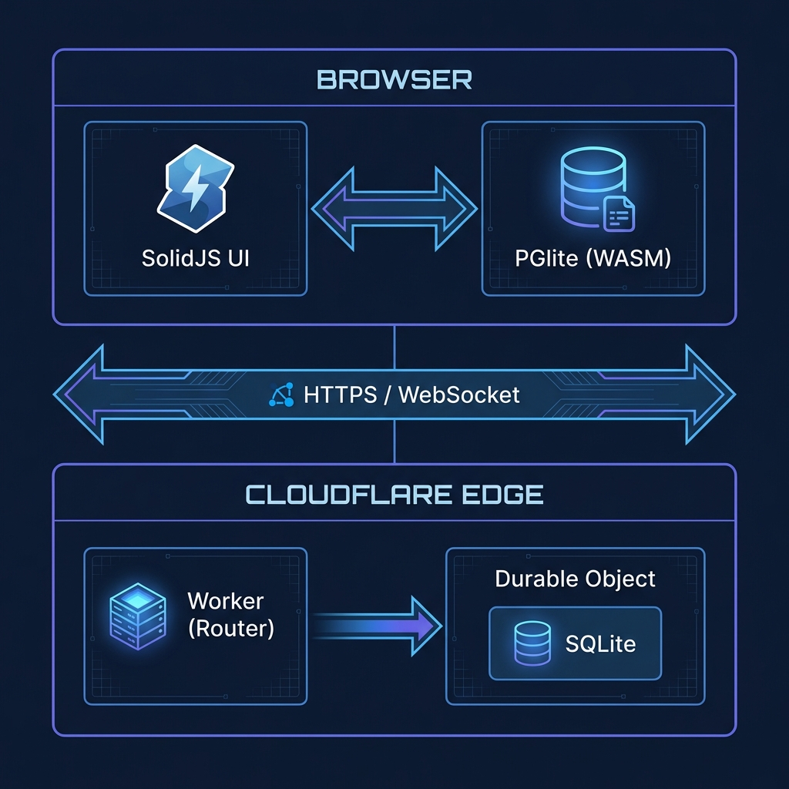

# Velocity CMS

A lean, edge-native Kanban board for content management pipelines.

**Live:** [velocity-frontend.pages.dev](https://e7c5d55d.velocity-frontend.pages.dev) | **API:** [velocity-backend.iamkingori.workers.dev](https://velocity-backend.iamkingori.workers.dev)

## Quick Start

```bash
# Frontend
cd frontend && npm install && npm run dev

# Backend (requires Wrangler)
cd backend && npm install && npx wrangler dev
```

## Architecture



## Project Structure

```
dot1/
├── frontend/          # SolidJS + Vite app
│   └── src/
│       ├── components/Kanban/   # Board, Column, Card
│       └── db/                  # PGlite client
├── backend/           # Cloudflare Worker
│   └── src/
│       ├── index.ts            # Entry point
│       └── ProjectBrain.ts     # Durable Object
└── shared/            # Shared TypeScript types
    └── types.ts
```

## Features

- **5-Column Kanban**: Backlog → Researching → Drafting → Review → Published
- **Real-Time Sync**: WebSocket updates from backend
- **Local-First**: Works offline with PGlite

## Docs

- [PRD](docs/PRD.md) - Product requirements
- [Architecture](docs/ARCHITECTURE.md) - System design
- [API](docs/API.md) - Backend endpoints
- [Deploy](docs/DEPLOY.md) - Deployment guide

## License

MIT
