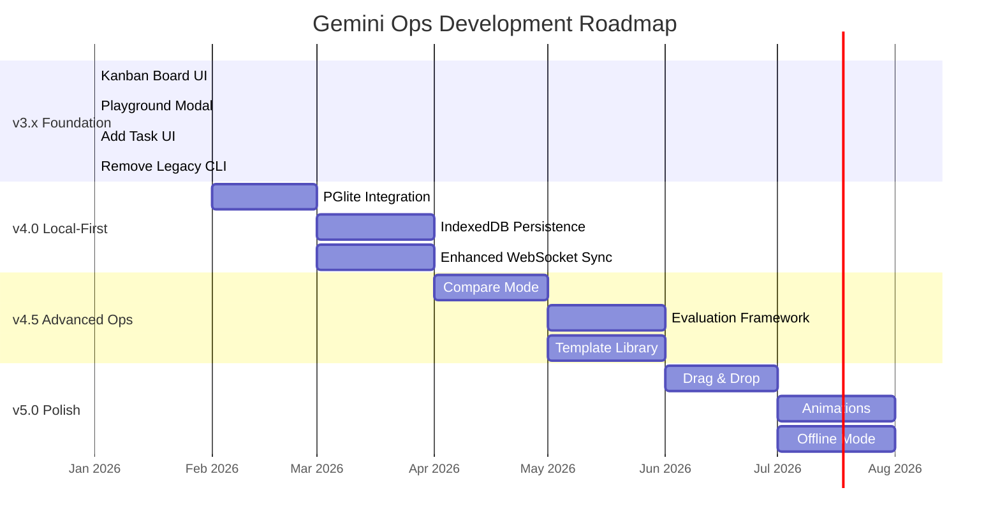

# Gemini Ops Roadmap

> Visual roadmap for the Gemini Operations Platform.

---

## Phase Breakdown

### Phase 1: Local Intelligence (v4.0) - Q1 2026
| Task | Description | Status |
|------|-------------|--------|
| PGlite Integration | Replace in-memory store with WASM Postgres | Planned |
| IndexedDB Persistence | Persist PGlite to browser storage | Planned |
| Advanced Querying | Enable SQL filtering/sorting on tasks | Planned |

### Phase 2: Enhanced Sync (v4.0) - Q1-Q2 2026
| Task | Description | Status |
|------|-------------|--------|
| Robust Sync Protocol | Upgrade WebSocket buffer | Planned |
| Conflict Resolution | Handle local/edge conflicts gracefully | Planned |
| Delta Updates | MessagePack-based incremental sync | Planned |

### Phase 3: Advanced Prompt Ops (v4.5) - Q2 2026
| Task | Description | Status |
|------|-------------|--------|
| Compare Mode | Side-by-side version comparison | Planned |
| Evaluation Framework | Automated output scoring | Planned |
| Template Library | Reusable system prompts | Planned |

### Phase 4: UI Polish (v5.0) - Q3 2026
| Task | Description | Status |
|------|-------------|--------|
| Drag & Drop | Kanban column reordering | Planned |
| Animations | Enter/exit card transitions | Planned |
| Offline Mode | Full read/write offline support | Planned |

---

## Current Sprint Focus (Jan 2026)

- [x] Kanban Board Implementation
- [x] Playground Modal (Markdown, Params, History)
- [x] Add Task UI
- [x] CLI Removal
- [ ] Code Refactoring & Documentation
